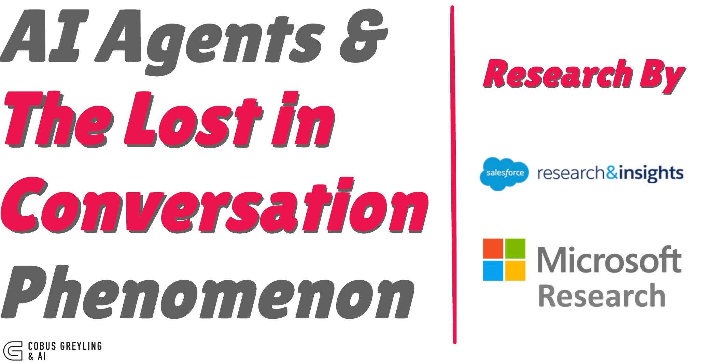
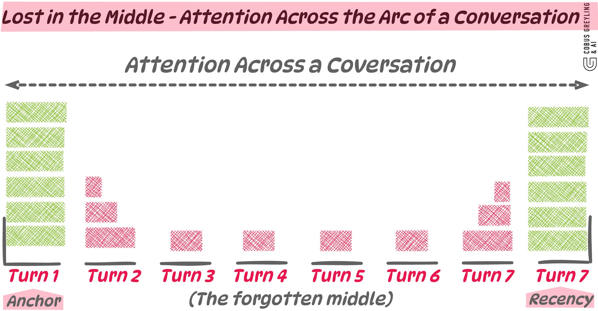
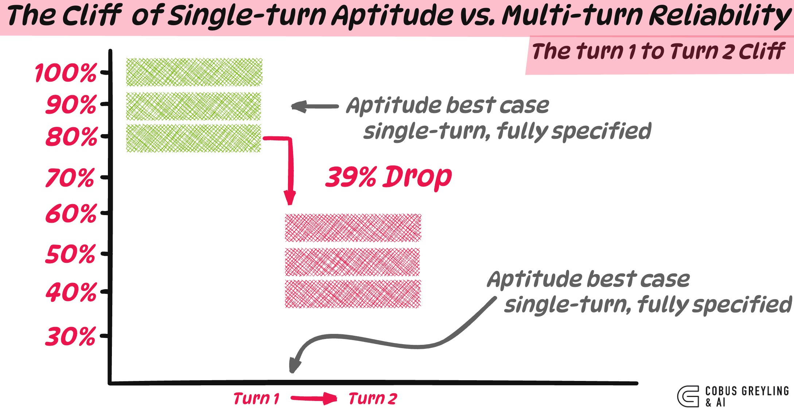

# AI Agents & The Lost in Conversation Phenomenon

*A new study from Microsoft Research and Salesforce Research quietly demolishes one of the more comfortable assumptions in agentic AI*

## When Agents Get Lost And Why the Harness Can Only Patch So Much

We can compensate for fragile models by building cleverer orchestration around them. Up to a point. After that, we are pushing on the wrong layer.

## The Finding That Should Reshape How We Think About Agents

The paper is called [LLMs Get Lost in Multi-Turn Conversation](https://arxiv.org/abs/2502.01601). I guess the headline number is striking on its own…

Across 200,000+ simulated conversations and 15 frontier LLMs (GPT-4.1, Claude 3.7 Sonnet, Gemini 2.5 Pro, o3, Deepseek-R1, and others)…

…the authors found an **average 39% performance drop** when the same task is delivered across multiple turns versus a single fully-specified instruction.

But the headline is not what kept me thinking about this paper for days afterwards…

What kept me thinking is the decomposition. The 39% drop is **not** mostly about capability. Aptitude, the model's best-case performance, only falls by about 15%. The real damage is in reliability.

**Reliability collapses by 112%.** Performance between best-case and worst-case runs of the exact same task differs by 50 percentage points on average.

In single-turn settings, the most capable models are also the most reliable. In multi-turn settings, every model, regardless of size, training, or reasoning capability, becomes unreliable in roughly the same way. The paper names this the **lost in conversation phenomenon**. When an LLM takes a wrong turn early in a conversation, it does not recover.

This is a finding about agents, even though the paper does not foreground it that way. Let me explain why.

## This Lands Squarely on Agents

An agent is, by construction, a multi-turn conversation the model has with itself and its tools. A ReAct loop…observation, thought, action, observation …is a sharded conversation. A planner-executor architecture distributes information across steps. A tool call returns a result that arrives, in effect, as a new turn. Every retrieval, every search, every API response is information delivered piece by piece.

The solution? **Aggressive consolidation, plus restart.**

## A few specifics worth sitting with

The paper finds that **reasoning models degrade more, not less**. This is because longer outputs accumulate more assumptions. Most production agents today rely on reasoning models for planning. The very models we lean on for agentic work are structurally prone to the bloat-and-drift pattern.

The **gradual sharding experiment** shows the cliff happens between turn 1 and turn 2. Granularity past that point barely matters. Any task whose information is distributed across more than a single turn triggers the effect.

The **loss-in-middle-turns observation**, finds that models attending to multi-turn context cite information from the first and last turns disproportionately, and quietly forget the middle. This is the same shape described in *Lost in the Middle* for long-context retrieval, just expressed across turns instead of across tokens.

That last point is the one I keep coming back to. The same attentional bias, anchor on the edges, lose the middle, appears at the token scale within a single forward pass and at the turn scale across a conversation. It is the same failure mode wearing two different costumes.

## So, Does the Harness Save Us?

This is the question I think most engineering teams are quietly asking themselves. If the model is unreliable across turns, surely the orchestration layer, the harness, the agent framework, the memory system, the context manager…all of that can compensate?

The paper tests this directly. The authors build two agent-style interventions on top of the multi-turn setting:

**RECAP:** replay all prior user information at the end of the conversation, giving the model one last fully-consolidated chance.

**SNOWBALL:** at every turn, re-state every previously revealed shard along with the new one.

These are essentially what production agent frameworks do…recap context, re-inject memory, accumulate state. The result?

Both strategies recover only **15–20% of the performance lost** between the single-turn and the multi-turn setting. They are better than nothing. They are nowhere near closing the gap.

There is a ceiling on what scaffolding can fix. Because the underlying model is still the thing making the premature commitments, generating the bloated answers and forgetting the middle turns. The harness can give it more redundancy, more structure, more reminders, but it cannot stop the model from anchoring on its first wrong guess.

So my honest answer is…yes, the harness becomes more important. As a defensive layer.

But the paper is making a sharper argument, and I think it is the right one. Treating the harness as the answer lets LLM builders off the hook for a problem they should be solving at the model level. We keep patching over multi-turn unreliability with cleverer orchestration, and the underlying behaviour stays exactly where it was.

Cursor users have settled on a folk-wisdom remedy, **start a new chat whenever you can**. That is itself a harness pattern, even if it is a manual one.

## Same Blindness, At Four Scales

I wrote in *Beyond Context* about what I called contextual blindness. The idea that the safety and reliability conversation in AI has been pointing at the wrong target. This new study is the same problem, surfaced at a different scale. In fact, I now think we are looking at one underlying pattern expressed at four scales:

**Token scale**
*Lost in the Middle*
Within a single forward pass, attention degrades on middle content.

**Turn scale**
*Lost in Conversation*
Across multiple turns of dialogue, middle turns get neglected and early assumptions calcify into facts.

**Loop scale**
*Agentic systems*
Across an agent's planning and tool-use loop, the same anchoring and bloat patterns drive cascading drift.

**User scale**
*Contextual Blindness*
Across an entire interaction, the system substitutes confident-sounding output for genuine understanding of what the user actually wants.

## For Anyone Building Agents Right Now

**The benchmark numbers we have been using are misleading.**

Most LLM benchmarks measure single-turn, fully-specified performance. The paper shows this overestimates real performance by 25–40 percentage points for multi-turn, underspecified use. The lab number is not the field number.

**The agent framework is not where the reliability lives.**

It can claw back 15–20%. That is real, and worth doing. Aggressive consolidation is the most reliable pattern available today. Ask the model to summarise everything it has been told. Take that consolidated summary into a fresh context, and treat each significant inflection point as an excuse to restart with consolidated state. This is not elegant. It is not what we want long-term. It is what works now.

**The model-level fix is what matters.**

The paper's call to action, and I agree with it, is that LLM builders need to jointly optimise aptitude and multi-turn reliability. A model that is brilliant 70% of the time and incoherent 30% of the time is, in many real deployments, worse than a less capable model that is consistently competent.

## Lastly

The story is that we have been measuring the wrong thing for a while now. Single-turn benchmarks reward exactly the behaviours that fail in multi-turn settings. Confident first answers, dense outputs, full task completion attempts. The leaderboards have been telling us the models are getting better. The lost-in-conversation phenomenon suggests they have been getting better at the test without getting meaningfully better at the underlying job.

For agents, this is not a marginal concern. It is the central concern. And no amount of harness engineering, prompt engineering, or framework cleverness substitutes for fixing it where it actually lives…

**In how the model attends across context, across turns, and across the entire arc of an interaction.**

---

*Cobus Greyling*

*Chief AI Evangelist @ Kore.ai | I'm passionate about exploring the intersection of AI and language. From Language Models, AI Agents to Agentic Applications, Development Frameworks & Data-Centric Productivity Tools, I share insights and ideas on how these technologies are shaping the future.*

**Reference:** [LLMs Get Lost In Multi-Turn Conversation](https://arxiv.org/abs/2502.01601) — Large Language Models (LLMs) are conversational interfaces. As such, LLMs have the potential to assist their users not just in single-turn interactions, but across extended multi-turn conversations.
