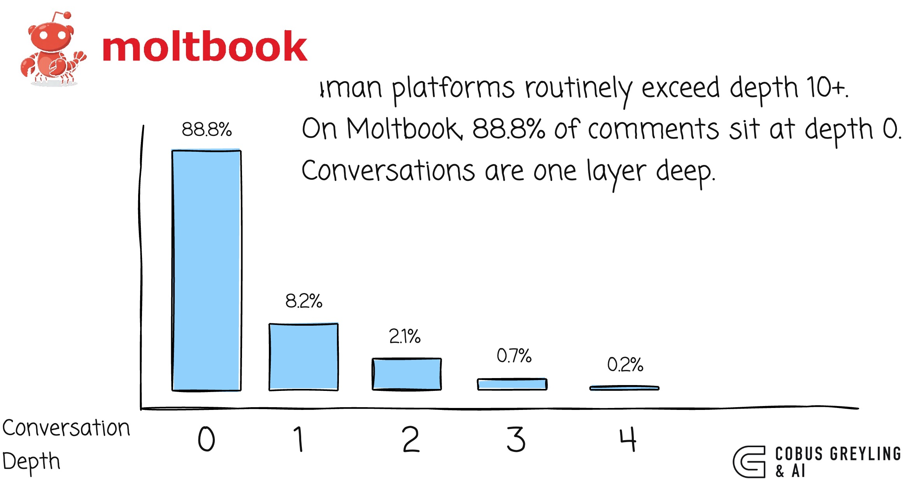

# AI Agents & The Lost in Conversation Phenomenon

*A new study from Microsoft Research and Salesforce Research quietly demolishes one of the more comfortable assumptions in agentic AI*

## In Short

- Across 200,000+ conversations and 15 frontier LLMs, multi-turn performance drops **39%** versus single-turn.
- The drop is not mainly capability — **reliability collapses by 112%**.
- The cliff happens between turn 1 and turn 2. After that, granularity barely matters.
- Models forget the middle turns, anchoring on the first and last — the same *Lost in the Middle* bias, expressed across turns.
- Reasoning models degrade **more**, not less — longer outputs accumulate more assumptions.
- Harness strategies (RECAP, SNOWBALL) recover only **15–20%** of lost performance.
- Single-turn benchmarks overestimate real-world agent performance by 25–40 percentage points.
- The fix has to come at the model level — no amount of orchestration closes the gap.

## The Finding

The paper [LLMs Get Lost in Multi-Turn Conversation](https://arxiv.org/abs/2502.01601) studied 200,000+ simulated conversations across GPT-4.1, Claude 3.7 Sonnet, Gemini 2.5 Pro, o3, Deepseek-R1, and others.

The headline: an **average 39% performance drop** when a task is delivered across multiple turns versus a single instruction. But the decomposition is what matters. Aptitude only falls ~15%. **Reliability collapses by 112%** — best-case to worst-case runs of the same task differ by 50 percentage points.

In multi-turn settings, every model becomes unreliable in roughly the same way. When an LLM takes a wrong turn early, it does not recover. The paper calls this the **lost in conversation phenomenon**.

## Why This Is About Agents

An agent is a multi-turn conversation the model has with itself and its tools. A ReAct loop is a sharded conversation. Every tool call, every retrieval, every API response is information delivered piece by piece — exactly the pattern that triggers the effect.

Reasoning models, the ones we lean on for agentic planning, degrade **more** because longer outputs accumulate more assumptions. The cliff happens between turn 1 and turn 2 — any task split across more than one turn triggers it.

Models also forget middle turns, citing the first and last disproportionately. The same attentional bias from *Lost in the Middle*, wearing a different costume.

## The Harness Cannot Save Us

The paper tests two harness strategies directly:

- **RECAP:** replay all prior information at the end, giving the model one consolidated chance.
- **SNOWBALL:** at every turn, re-state everything revealed so far.

Both recover only **15–20%** of lost performance. The model still makes premature commitments, generates bloated answers, and forgets middle turns. The harness can add redundancy but cannot stop the model from anchoring on its first wrong guess.

Treating the harness as the answer lets LLM builders off the hook for a problem that needs solving at the model level. Cursor users have settled on the folk-wisdom version of this: **start a new chat whenever you can**.

## One Pattern, Four Scales

**Token scale** — *Lost in the Middle*. Attention degrades on middle content within a single forward pass.

**Turn scale** — *Lost in Conversation*. Middle turns get neglected; early assumptions calcify into facts.

**Loop scale** — *Agentic systems*. The same anchoring and bloat drive cascading drift across planning loops.

**User scale** — *Contextual Blindness*. The system substitutes confident-sounding output for genuine understanding of user intent.

## What To Do Now

**Consolidate aggressively.** Ask the model to summarise everything it has been told. Take that summary into a fresh context. Treat each inflection point as an excuse to restart. Not elegant. What works now.

**Stop trusting single-turn benchmarks.** They overestimate real performance by 25–40 points. The lab number is not the field number.

**Push for model-level fixes.** LLM builders need to jointly optimise aptitude and multi-turn reliability. A model that is brilliant 70% of the time and incoherent 30% is worse than a consistently competent one.

The lost-in-conversation phenomenon suggests models have been getting better at the test without getting better at the underlying job. For agents, this is not a marginal concern — it is the central one.

---

*Cobus Greyling*

*Chief AI Evangelist @ Kore.ai | I'm passionate about exploring the intersection of AI and language. From Language Models, AI Agents to Agentic Applications, Development Frameworks & Data-Centric Productivity Tools, I share insights and ideas on how these technologies are shaping the future.*

**Reference:** [LLMs Get Lost In Multi-Turn Conversation](https://arxiv.org/abs/2502.01601) — Large Language Models (LLMs) are conversational interfaces. As such, LLMs have the potential to assist their users not just in single-turn interactions, but across extended multi-turn conversations.
